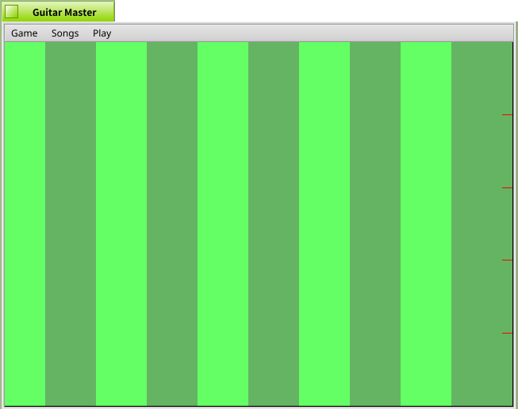

# Guitar Master
The MIT License (MIT)

Copyright (c) 2013 quiqueiii

Guitar Master is a Frets-on-Fire clone for Haiku.

However, it is unfinished and not usable.
To finish the clone, these dependencies would probably be needed:
* fonts-mgopen
* python
* python-imaging
* python-ogg
* python-opengl
* python-pygame
* python-pyvorbis
* fonts-dejavu

